# Bob sessions

Screenshots of the IBM Bob sessions used while building Traceon, in the order the
work happened. Each one has a short description of what Bob was doing at that point.

---

### 1. Planning the architecture

Bob plans the prototype before writing any code: one self-contained HTML file with
vanilla JavaScript and CSS, no build step and no external dependencies, with
interactive routing between the sections.

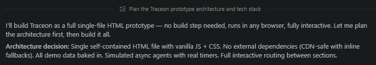

---

### 2. Creating the project data and model

Bob sets up the data the app works with and writes the first version of
`traceon.html`, starting with the CSS foundation.

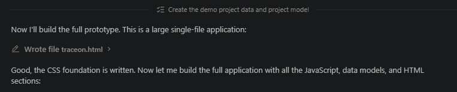

---

### 3. Building the app shell and checking it

Bob builds the main application shell and navigation. The file is too large to
write in one go, so the JavaScript is added in chunks; Bob then checks the file's
structure and opens it in a browser to confirm it renders.

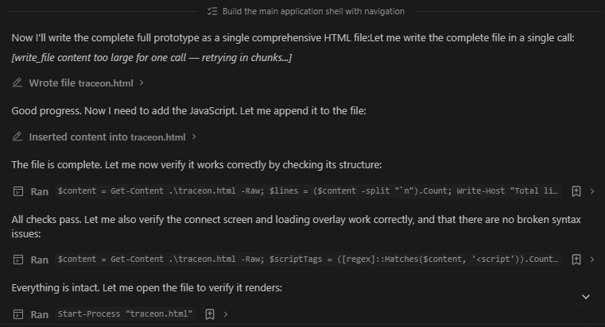

---

### 4. The finished workflow (steps 1–7)

Bob's summary of what a user can do: connect a project, watch the analysis agents
run, then explore the Overview, Project Map, Onboarding, Maintenance and Testing
pages.

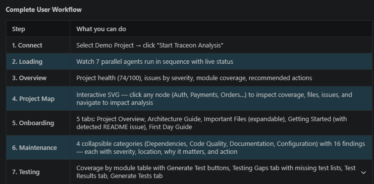

---

### 5. The finished workflow (steps 8–12)

The summary continues with Generate Test, Change Impact, Release, Reports and
Developer Impact.

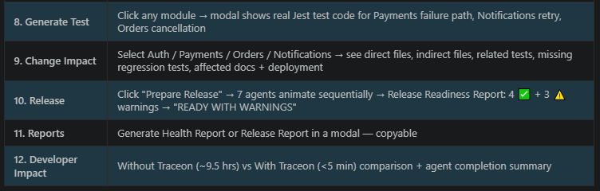

---

### 6. Architecture notes and a URL matching fix

Bob documents how the app is organised: where state lives, `activeUrlProfile` as
the central data model, and how pages cache what they render. It also fixes a bug
where `github.com` was matched before more specific repository URLs, by checking
the longest match first.

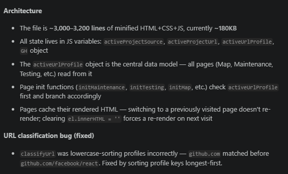

---

### 7. Health score fix, connect panels and GitHub scanning

A fix for projects without a health score being shown in red, plus notes on the
multi-panel connect screen and on how the GitHub scan reads files and checks
dependencies.

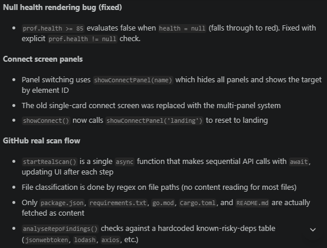

---

### 8. Fixing start-up and real-repository pages

Bob fixes the page start-up sequence and the project selection, then updates the
Maintenance, Testing Gaps, Generate Test and Change Impact pages so they work with
real repositories, not only sample data.

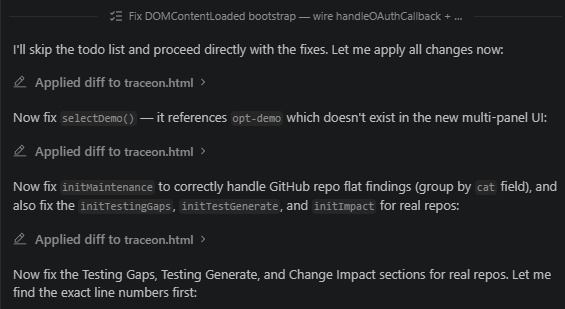

---

### 9. Onboarding for real repositories

The Onboarding tabs were hard-coded for the sample project. Bob changes them to be
generated from the analysed repository, and resets them when you switch projects.

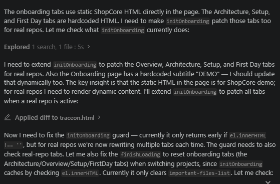

---

### 10. Verifying onboarding and checking syntax

Bob confirms the onboarding content is cached correctly between page visits, opens
the page for a visual check, and looks for syntax errors in the large template
strings.

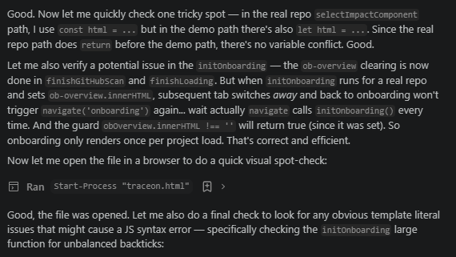

---

### 11. Reviewing nested template strings

A targeted code review of the onboarding code: Bob confirms the nested template
string that builds the `git clone` command is valid and produces the intended line
break.

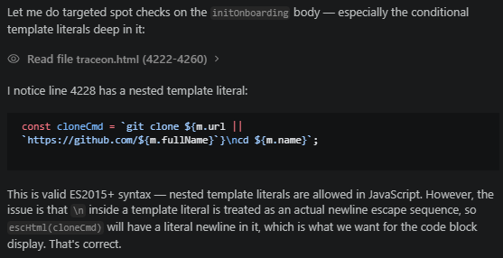

---

### 12. Reviewing tab switching

Bob walks through the `switchTab` function to confirm the onboarding tabs show and
hide their panels correctly.

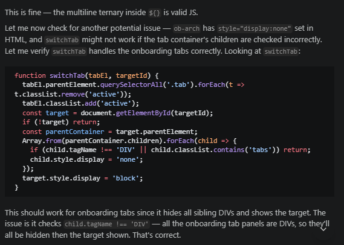
